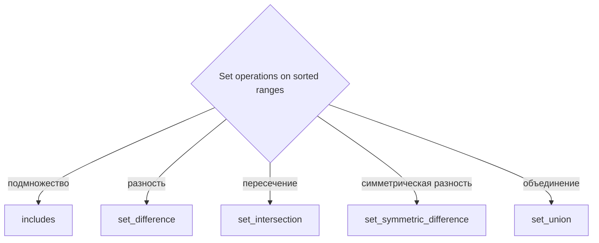

```mermaid
graph TD

    C{Set operations on sorted ranges}
    C -->|подмножество| D[includes]
    C -->|разность| E[set_difference]
    C -->|пересечение| F[set_intersection]
    C -->|симметрическая разность| G[set_symmetric_difference]
    C -->|объединение| H[set_union]
```
